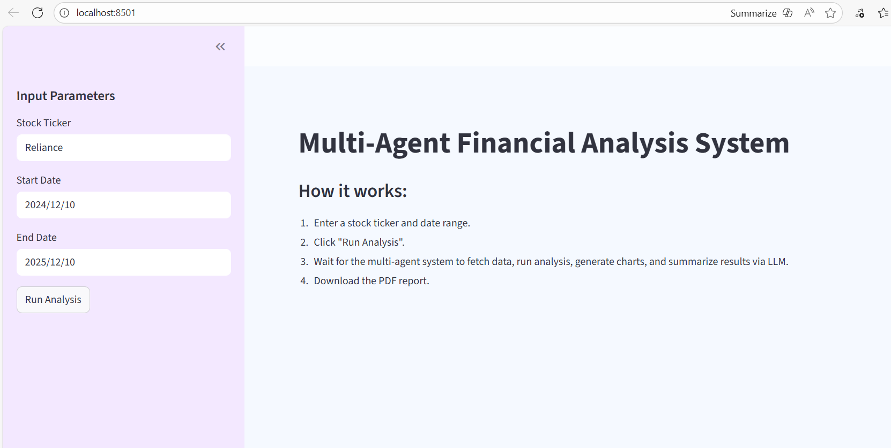

# 💬 MultiAgent Financial Analysis System (Agentic AI project using LLama3.3 and GROQ)

Folder structure
1. app: All the code for MultiAgent Finanacial Analysis System
2. charts,reports:contain the results 

This multiagent currently supports user inputs for ticker and date range:

- **Tickers**: ["RELIANCE", "HDFC", "INFY", "ASIANPAINT", "BHARTIARTL", "ICICIBANK","TCS"]etc
- **Date Range**: Historic data stored in .csv file, historic data collected from year 2020 to 2025(5 year OHLCV data)





## Architecture


### Set-up & Execution

1. Run the following command to install all dependencies. 

    ```bash
    pip install -r app/requirements.txt
    ```

1. Inside app folder, create a .env file with your GROQ credentials as follows:
    ```text
    GROQ_MODEL=<Add the model name, e.g. llama-3.3-70b-versatile>
    GROQ_API_KEY=<Add your groq api key here>
    ```

1. Run the streamlit app by running the following command.

    ```bash
    streamlit run app/main.py
    ```

---
2. 
Copyright All rights reserved.
